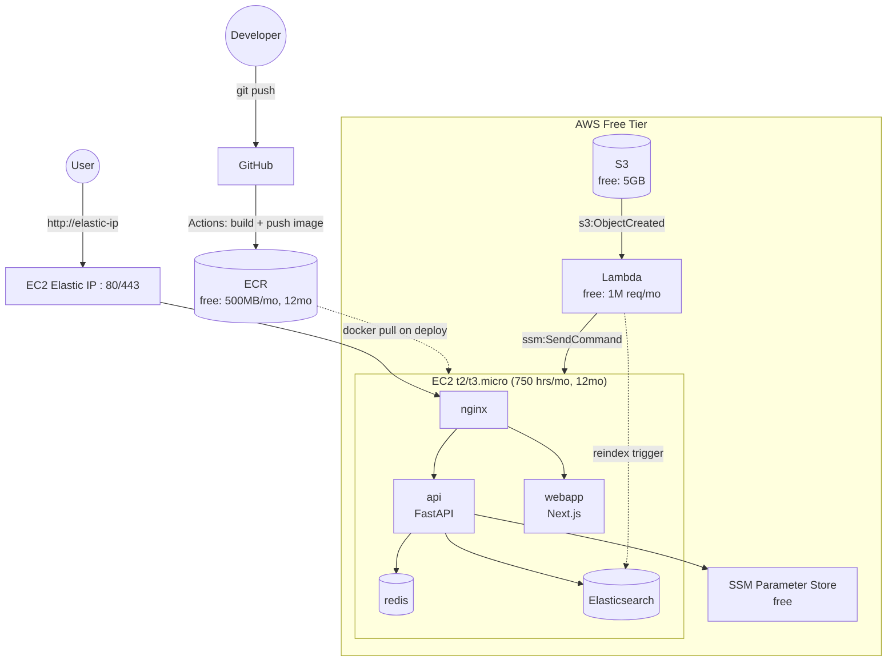

# AWS Architecture

Simple, low-ops, **$0 (free-tier)** deployment for the multi-agentic system:
one EC2 instance running the app containers (images built by CI/CD and
pulled from ECR), Elasticsearch as the search/vector store, exposed directly
via the instance's public IP — no API Gateway, no ALB.

## Diagram

## Component mapping

| Compose service | AWS equivalent | Notes |
|---|---|---|
| `nginx` | nginx container on the same EC2 instance | Same path-based routing to `webapp` and `api` as today; no ALB. |
| `api` (FastAPI) | Container on EC2, image from ECR | Built and pushed by GitHub Actions on every push to `main`; EC2 pulls, never builds. |
| `webapp` (Next.js) | Container on EC2, image from ECR | Same CI/CD path as `api`. |
| `redis` | `redis` container on the same box | Persists to the instance's EBS volume via `appendonly yes`. |
| `chromadb` | **Elasticsearch container** on the same box | Swapped in place of ChromaDB as the search/vector store; data on EBS. Auto-updated via the S3 → Lambda → EC2 reindex pipeline. |
| `traces_data` volume | S3 bucket (optional) | Optional durable storage for trace JSONL files; simplest option is to leave traces on the instance's EBS volume. |
| `.env` secrets | SSM Parameter Store (Standard tier) | Fetched by the deploy script at deploy time, never baked into the image or repo. |
| — | EC2 Elastic IP | Public entry point — users hit nginx on the instance directly, no API Gateway/ALB in front. |

## Why this is "simple"

- One EC2 instance, no ECS/Kubernetes — `docker compose up -d` is the entire deploy mechanism.
- No new database engine beyond what's already self-hosted today: Elasticsearch replaces ChromaDB as the one stateful service still running in a container.
- CI/CD is a straight line: push → GitHub Actions builds & pushes to ECR → SSM Run Command tells EC2 to pull & restart.

## Why not Lambda for the app itself?

Lambda works for short-lived, request/response workloads (container images
up to 10GB, 15-minute max execution) — fine for the S3→Lambda reindex hook,
not fine for `api`/`webapp`, which are long-running servers with persistent
connections (and Elasticsearch, which is a stateful daemon, not a function at
all). Hence: app + Elasticsearch stay on EC2; only the reindex trigger is
Lambda.

## Scaling later, if needed

- Move off the single EC2 box to ECS Fargate + ALB once free tier stops being the priority (see below).
- Swap `redis` for ElastiCache, and Elasticsearch for a managed OpenSearch domain, once a single instance can't keep up.

---

## Caveats

- **Single point of failure**: one instance, no redundancy for `api`, `redis`, `elasticsearch`, or `webapp`. Acceptable for a demo/personal project, not for production traffic.
- **Elasticsearch memory**: a `t2.micro`/`t3.micro` has only 1GB RAM total, and ES typically wants ≥2GB heap. Expect to tune `ES_JAVA_OPTS` down (e.g. `-Xms256m -Xmx256m`) or accept it may be slow/unstable under load — bump to `t3.small` (not free tier, ~$15/mo) if this becomes a real problem.
- **No managed TLS**: hitting the EC2 IP directly means no free TLS termination the way API Gateway/ALB/CloudFront would give you. Use a plain `http://` Elastic IP for now, or put Caddy/Let's Encrypt in front of nginx later if you need HTTPS.
- **Elastic IP required**: without one, a stopped/restarted instance gets a new public IP and any bookmarked/DNS-pointed URL breaks. An Elastic IP (free while attached to a running instance) avoids this — see setup guide 1.4a.
- **12-month clock**: EC2 and ECR free tiers expire after 12 months from account creation; EC2 then costs a few dollars/month for a `t3.micro`, and ECR storage beyond 500MB is billed (~$0.10/GB-month) — both still far cheaper than an ALB+Fargate design.
- **Reboots lose in-memory Redis state** unless `appendonly yes` (already set in the compose file) persists it to the EBS volume, which it does.

---

## If you outgrow free tier: ECS Fargate + ALB

Once cost stops being the constraint, the natural next step is: `nginx` → ALB
(path-based routing to `webapp`/`api` target groups), `api`/`webapp` →
one ECS Fargate service each (desired count 2+, target-tracking autoscaling
on CPU), `redis` → ElastiCache, Elasticsearch → a managed OpenSearch domain,
`.env` → Secrets Manager, and CloudFront in front of the ALB for CDN/TLS.
Same component shapes as today, just each piece promoted to its managed AWS
equivalent — no rearchitecting needed when that day comes.
