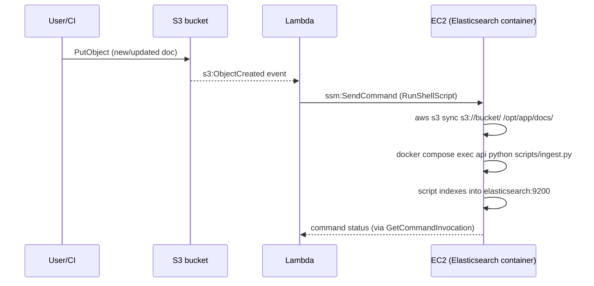

# AWS Setup Guide — Step by Step

Companion to [aws-architecture.md](aws-architecture.md). This assumes the
**free-tier variant**: one EC2 instance running `api`, `webapp`, `redis`, and
`elasticsearch` containers, images pulled from **ECR** (built by CI/CD, not
built on the box), exposed publicly via the instance's **Elastic IP**
directly — no API Gateway, no ALB. Three parts:

1. GitHub Actions CI/CD — build & push images to ECR on every push to `main`, then trigger a deploy.
2. AWS resource creation — EC2, IAM, ECR, S3, SSM, security groups, Elastic IP.
3. RAG auto-update pipeline — S3 upload → Lambda → EC2, re-indexes into Elasticsearch.

---

## Part 1 — AWS resources, step by step

Do this first; CI/CD in Part 2 deploys *into* these resources.

### 1.1 IAM: deploy user + EC2 instance role

Two separate identities — don't reuse one for both:

- **`gha-deploy` IAM user** — GitHub Actions uses this to push images to ECR and trigger deploys via SSM. Access-key credentials, stored as GitHub secrets.
- **`ec2-app-role` IAM role** — attached to the EC2 instance itself. Lets the instance pull from ECR, read SSM parameters, and receive SSM Run Command without any credentials stored on disk.

```bash
# --- gha-deploy user (used by GitHub Actions) ---
aws iam create-user --user-name gha-deploy

aws iam attach-user-policy \
  --user-name gha-deploy \
  --policy-arn arn:aws:iam::aws:policy/AmazonEC2ContainerRegistryPowerUser

# Custom policy so it can trigger SSM Run Command on the instance (see 2.3)
cat > gha-deploy-ssm-policy.json <<'EOF'
{
  "Version": "2012-10-17",
  "Statement": [
    {
      "Effect": "Allow",
      "Action": ["ssm:SendCommand", "ssm:GetCommandInvocation"],
      "Resource": "*"
    }
  ]
}
EOF
aws iam put-user-policy \
  --user-name gha-deploy \
  --policy-name gha-deploy-ssm \
  --policy-document file://gha-deploy-ssm-policy.json

aws iam create-access-key --user-name gha-deploy
# Save AccessKeyId + SecretAccessKey → GitHub repo secrets (Part 2)
```

```bash
# --- ec2-app-role (attached to the instance) ---
aws iam create-role \
  --role-name ec2-app-role \
  --assume-role-policy-document '{
    "Version": "2012-10-17",
    "Statement": [{
      "Effect": "Allow",
      "Principal": {"Service": "ec2.amazonaws.com"},
      "Action": "sts:AssumeRole"
    }]
  }'

aws iam attach-role-policy --role-name ec2-app-role \
  --policy-arn arn:aws:iam::aws:policy/AmazonEC2ContainerRegistryReadOnly
aws iam attach-role-policy --role-name ec2-app-role \
  --policy-arn arn:aws:iam::aws:policy/AmazonSSMManagedInstanceCore   # enables Run Command, no SSH key needed
aws iam attach-role-policy --role-name ec2-app-role \
  --policy-arn arn:aws:iam::aws:policy/AmazonS3ReadOnlyAccess          # for RAG doc pulls, Part 3

aws iam create-instance-profile --instance-profile-name ec2-app-profile
aws iam add-role-to-instance-profile \
  --instance-profile-name ec2-app-profile --role-name ec2-app-role
```

### 1.2 ECR: one repo per image

```bash
aws ecr create-repository --repository-name multi-agentic/api
aws ecr create-repository --repository-name multi-agentic/webapp
```

### 1.3 Security group

```bash
aws ec2 create-security-group \
  --group-name multi-agentic-sg \
  --description "multi-agentic-system EC2" \
  --vpc-id <YOUR_VPC_ID>

SG_ID=<returned GroupId>

# HTTP/HTTPS directly from the internet — this instance is the public entry point now
aws ec2 authorize-security-group-ingress --group-id $SG_ID \
  --protocol tcp --port 80 --cidr 0.0.0.0/0
aws ec2 authorize-security-group-ingress --group-id $SG_ID \
  --protocol tcp --port 443 --cidr 0.0.0.0/0

# No inbound SSH rule needed — SSM Session Manager replaces it.
# If you still want SSH, restrict it to your IP:
# aws ec2 authorize-security-group-ingress --group-id $SG_ID \
#   --protocol tcp --port 22 --cidr <YOUR_IP>/32
```

### 1.4 Launch the EC2 instance

```bash
aws ec2 run-instances \
  --image-id <latest Amazon Linux 2023 AMI ID for your region> \
  --instance-type t3.micro \
  --iam-instance-profile Name=ec2-app-profile \
  --security-group-ids $SG_ID \
  --subnet-id <YOUR_SUBNET_ID> \
  --associate-public-ip-address \
  --block-device-mappings '[{"DeviceName":"/dev/xvda","Ebs":{"VolumeSize":20,"VolumeType":"gp3"}}]' \
  --user-data file://ec2-bootstrap.sh \
  --tag-specifications 'ResourceType=instance,Tags=[{Key=Name,Value=multi-agentic-system}]'
```

`ec2-bootstrap.sh` — installs Docker, Docker Compose, and the SSM agent
(preinstalled on AL2023). It does **not** clone the repo or build
images — the app's `docker-compose.yml` (pointing at ECR image tags) and
`.env` are placed on the box by the first deploy from GitHub Actions (Part
2), not by bootstrap:

```bash
#!/bin/bash
dnf install -y docker
systemctl enable --now docker
usermod -aG docker ec2-user

curl -SL https://github.com/docker/compose/releases/latest/download/docker-compose-linux-x86_64 \
  -o /usr/local/bin/docker-compose
chmod +x /usr/local/bin/docker-compose

mkdir -p /opt/app
chown ec2-user:ec2-user /opt/app
```

No inbound SSH key needed for day-2 operations — GitHub Actions and you both
use `aws ssm start-session --target <instance-id>` or `send-command`.

### 1.4a Allocate an Elastic IP (recommended)

The public IP on a stopped/restarted instance changes; since users hit this
instance directly (no API Gateway/ALB in front to absorb that), pin a fixed
address now — it's free while attached to a running instance:

```bash
aws ec2 allocate-address --domain vpc
aws ec2 associate-address --instance-id <INSTANCE_ID> --allocation-id <ALLOCATION_ID>
```

### 1.5 SSM Parameter Store — app secrets

```bash
aws ssm put-parameter --name /multi-agentic/OPENAI_API_KEY --type SecureString --value "sk-..."
aws ssm put-parameter --name /multi-agentic/CORS_ORIGINS --type String --value "https://yourdomain.com"
# repeat for each var currently in .env
```

The instance pulls these at deploy time (script in Part 2) rather than
baking secrets into the AMI or the git repo.

### 1.6 S3 bucket — RAG source documents

```bash
aws s3 mb s3://multi-agentic-rag-docs
aws s3api put-bucket-versioning --bucket multi-agentic-rag-docs \
  --versioning-configuration Status=Enabled
```

This is the bucket people upload/update knowledge-base docs to — wired up in
Part 3.

### 1.7 (Optional) CloudFront + domain

Skipped by default in this design — the Elastic IP (1.4a) is the public entry
point, plain `http://`, no managed TLS. Add CloudFront back later only if you
want edge caching, a custom domain, or a free ACM cert in front of the
instance.

---

## Part 2 — GitHub Actions CI/CD

Repo secrets to add (Settings → Secrets and variables → Actions):

| Secret | Value |
|---|---|
| `AWS_ACCESS_KEY_ID` / `AWS_SECRET_ACCESS_KEY` | from `gha-deploy` user (1.1) |
| `AWS_REGION` | e.g. `us-east-1` |
| `ECR_REGISTRY` | `<account-id>.dkr.ecr.<region>.amazonaws.com` |
| `EC2_INSTANCE_ID` | from `run-instances` output |

`.github/workflows/deploy.yml`:

```yaml
name: Build and Deploy

on:
  push:
    branches: [main]

jobs:
  build-and-push:
    runs-on: ubuntu-latest
    permissions:
      contents: read
    steps:
      - uses: actions/checkout@v4

      - uses: aws-actions/configure-aws-credentials@v4
        with:
          aws-access-key-id: ${{ secrets.AWS_ACCESS_KEY_ID }}
          aws-secret-access-key: ${{ secrets.AWS_SECRET_ACCESS_KEY }}
          aws-region: ${{ secrets.AWS_REGION }}

      - uses: aws-actions/amazon-ecr-login@v2
        id: ecr

      - name: Build & push api image
        run: |
          docker build -t ${{ steps.ecr.outputs.registry }}/multi-agentic/api:${{ github.sha }} \
            -t ${{ steps.ecr.outputs.registry }}/multi-agentic/api:latest -f Dockerfile .
          docker push ${{ steps.ecr.outputs.registry }}/multi-agentic/api:${{ github.sha }}
          docker push ${{ steps.ecr.outputs.registry }}/multi-agentic/api:latest

      - name: Build & push webapp image
        run: |
          docker build -t ${{ steps.ecr.outputs.registry }}/multi-agentic/webapp:${{ github.sha }} \
            -t ${{ steps.ecr.outputs.registry }}/multi-agentic/webapp:latest ./webapp
          docker push ${{ steps.ecr.outputs.registry }}/multi-agentic/webapp:${{ github.sha }}
          docker push ${{ steps.ecr.outputs.registry }}/multi-agentic/webapp:latest

  deploy:
    needs: build-and-push
    runs-on: ubuntu-latest
    steps:
      - uses: aws-actions/configure-aws-credentials@v4
        with:
          aws-access-key-id: ${{ secrets.AWS_ACCESS_KEY_ID }}
          aws-secret-access-key: ${{ secrets.AWS_SECRET_ACCESS_KEY }}
          aws-region: ${{ secrets.AWS_REGION }}

      - name: Deploy via SSM Run Command
        run: |
          aws ssm send-command \
            --instance-ids "${{ secrets.EC2_INSTANCE_ID }}" \
            --document-name "AWS-RunShellScript" \
            --comment "Deploy multi-agentic-system ${{ github.sha }}" \
            --parameters commands='[
              "aws ecr get-login-password --region ${{ secrets.AWS_REGION }} | docker login --username AWS --password-stdin ${{ secrets.ECR_REGISTRY }}",
              "mkdir -p /opt/app && cd /opt/app",
              "aws ssm get-parameters-by-path --path /multi-agentic --with-decryption --query \"Parameters[].{Name:Name,Value:Value}\" --output json | python3 -c \"import json,sys; d=json.load(sys.stdin); print(chr(10).join(f\\\"{p[chr(39)+chr(78)+chr(97)+chr(109)+chr(101)+chr(39)].split(chr(47))[-1]}={p[chr(39)+chr(86)+chr(97)+chr(108)+chr(117)+chr(101)+chr(39)]}\\\" for p in d))\" > .env",
              "echo IMAGE_TAG=${{ github.sha }} >> .env",
              "docker compose -f docker-compose.deploy.yml pull",
              "docker compose -f docker-compose.deploy.yml up -d"
            ]'
```

This deploys from **`docker-compose.deploy.yml`**, a separate compose file
(checked into the repo, alongside the local-dev `docker-compose.yml`) whose
`api` and `webapp` services use `image:` referencing the ECR registry instead
of `build:` — the box only ever pulls pre-built images, it never runs a
Docker build. `redis` and `elasticsearch` keep using their public images
directly, unchanged:

```yaml
# docker-compose.deploy.yml
services:
  api:
    image: ${ECR_REGISTRY}/multi-agentic/api:${IMAGE_TAG:-latest}
    env_file: .env
    # ports/volumes/depends_on: same as docker-compose.yml
  webapp:
    image: ${ECR_REGISTRY}/multi-agentic/webapp:${IMAGE_TAG:-latest}
    env_file: .env
  redis:
    image: redis:7-alpine
    command: redis-server --appendonly yes
    volumes: [redis_data:/data]
  elasticsearch:
    image: docker.elastic.co/elasticsearch/elasticsearch:8.15.0
    environment:
      - discovery.type=single-node
      - xpack.security.enabled=false
      - ES_JAVA_OPTS=-Xms256m -Xmx256m   # keep this small on a 1GB t3.micro
    volumes: [es_data:/usr/share/elasticsearch/data]
  nginx:
    image: nginx:alpine
    ports: ["80:80"]
    depends_on: [api, webapp]

volumes:
  redis_data:
  es_data:
```

`ECR_REGISTRY` needs to also land in `/opt/app/.env` (add it as one more SSM
parameter or GitHub secret substituted into the deploy command) so
`docker compose pull` resolves the right registry. The parameter-fetch line
above is intentionally simple but ugly to avoid quoting issues inside YAML;
in practice replace it with a small `scripts/render_env.py` checked into the
repo and call that instead — cleaner and testable locally. The mechanism (SSM
Run Command executing shell on the instance, no SSH key, no open port 22, and
pulling immutable images instead of rebuilding) is what matters.

---

## Part 3 — RAG auto-update pipeline (S3 → Lambda → EC2)

Goal: someone uploads/updates a document in the `multi-agentic-rag-docs` S3
bucket → an S3 event fires → a Lambda function tells the EC2 instance (via
SSM Run Command) to pull the new file and re-index it into **Elasticsearch**,
which is already running as a container on that instance.



### 3.1 IAM role for the Lambda

```bash
aws iam create-role \
  --role-name rag-update-lambda-role \
  --assume-role-policy-document '{
    "Version": "2012-10-17",
    "Statement": [{
      "Effect": "Allow",
      "Principal": {"Service": "lambda.amazonaws.com"},
      "Action": "sts:AssumeRole"
    }]
  }'

aws iam attach-role-policy --role-name rag-update-lambda-role \
  --policy-arn arn:aws:iam::aws:policy/service-role/AWSLambdaBasicExecutionRole

# Custom policy: only SendCommand + GetCommandInvocation, scoped to this one instance
cat > rag-lambda-ssm-policy.json <<'EOF'
{
  "Version": "2012-10-17",
  "Statement": [{
    "Effect": "Allow",
    "Action": ["ssm:SendCommand", "ssm:GetCommandInvocation"],
    "Resource": [
      "arn:aws:ec2:*:*:instance/<EC2_INSTANCE_ID>",
      "arn:aws:ssm:*:*:document/AWS-RunShellScript"
    ]
  }]
}
EOF
aws iam put-role-policy \
  --role-name rag-update-lambda-role \
  --policy-name rag-lambda-ssm \
  --policy-document file://rag-lambda-ssm-policy.json
```

### 3.2 The Lambda function

`lambda/rag_update.py`:

```python
import os
import boto3

ssm = boto3.client("ssm")
INSTANCE_ID = os.environ["EC2_INSTANCE_ID"]
BUCKET = os.environ["RAG_BUCKET"]

def handler(event, context):
    ssm.send_command(
        InstanceIds=[INSTANCE_ID],
        DocumentName="AWS-RunShellScript",
        Comment="RAG doc update",
        Parameters={
            "commands": [
                f"aws s3 sync s3://{BUCKET}/ /opt/app/docs/ --delete",
                "cd /opt/app && docker compose exec -T api python scripts/ingest.py",
            ]
        },
    )
    return {"statusCode": 200}
```

Deploy:

```bash
cd lambda
zip rag_update.zip rag_update.py

aws lambda create-function \
  --function-name rag-update \
  --runtime python3.12 \
  --handler rag_update.handler \
  --role arn:aws:iam::<ACCOUNT_ID>:role/rag-update-lambda-role \
  --zip-file fileb://rag_update.zip \
  --timeout 30 \
  --environment "Variables={EC2_INSTANCE_ID=<EC2_INSTANCE_ID>,RAG_BUCKET=multi-agentic-rag-docs}"
```

### 3.3 Wire the S3 event to the Lambda

```bash
aws lambda add-permission \
  --function-name rag-update \
  --statement-id s3-invoke \
  --action lambda:InvokeFunction \
  --principal s3.amazonaws.com \
  --source-arn arn:aws:s3:::multi-agentic-rag-docs

aws s3api put-bucket-notification-configuration \
  --bucket multi-agentic-rag-docs \
  --notification-configuration '{
    "LambdaFunctionConfigurations": [{
      "LambdaFunctionArn": "arn:aws:lambda:<REGION>:<ACCOUNT_ID>:function:rag-update",
      "Events": ["s3:ObjectCreated:*", "s3:ObjectRemoved:*"]
    }]
  }'
```

### 3.4 `scripts/ingest.py` on the app side

This is the one piece that lives in the app repo, not AWS config — a script
that walks `/app/docs` (already mounted read-only into the `api` container
per `docker-compose.yml`) and indexes changed files into Elasticsearch (e.g.
via the `elasticsearch-py` client, `http://elasticsearch:9200`) instead of
ChromaDB. If this script doesn't exist yet, it needs writing (and `api`'s
vector/search client swapped from Chroma to ES) before Part 3 works
end-to-end; everything above this point is infra, not app logic.

### 3.5 Result

- Push a new/updated doc to `s3://multi-agentic-rag-docs/` → within seconds, Lambda tells the EC2 instance to sync the file and re-index — no redeploy, no CI run, no downtime.
- Cost: Lambda (1M free requests/mo, always free), S3 (5GB free tier), SSM (free) — this pipeline itself adds $0 on top of the EC2 instance already running.

---

## Order of operations

1. Part 1, sections 1.1–1.6, then 1.4a (Elastic IP) — skip 1.7, it's a no-op in this design.
2. Confirm the instance boots and, once the first image lands in ECR, `docker compose -f docker-compose.deploy.yml up -d` works manually once, by hand, over SSM Session Manager. Hit `http://<ELASTIC_IP>` in a browser to confirm nginx is serving traffic.
3. Part 2 — add GitHub secrets, commit `docker-compose.deploy.yml` and the workflow, push to `main`, confirm the deploy lands and images are pulled from ECR (not built on the box).
4. Part 3 — only after `scripts/ingest.py` exists, targets Elasticsearch, and has been tested locally against the running `elasticsearch` container.
