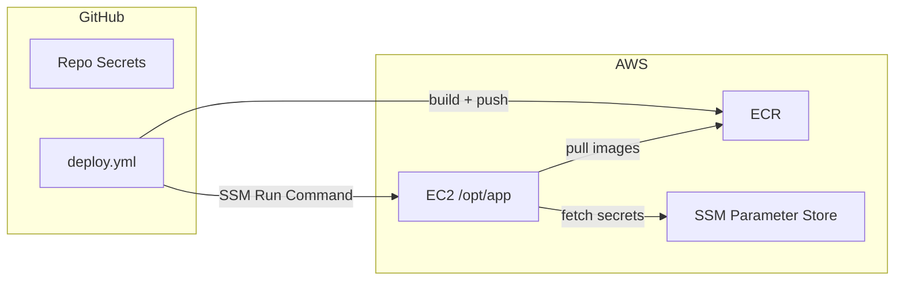

# End-to-End Setup: From Empty AWS Account to Running App

Phase 2 of the [AWS tutorials](../README.md) — **Integration**. This
assumes all seven resources from Phase 1 already exist. If they don't yet,
start there first, in this exact order:

1. [IAM — Identities and Permissions](../resource-creation/01-iam.md)
2. [ECR — Container Image Registry](../resource-creation/02-ecr.md)
3. [Security Group — Network Firewall](../resource-creation/03-security-group.md)
4. [EC2 Instance — The Server](../resource-creation/04-ec2-instance.md)
5. [Elastic IP — A Fixed Public Address](../resource-creation/05-elastic-ip.md)
6. [SSM Parameter Store — Application Secrets](../resource-creation/06-ssm-parameters.md)
7. [S3 Bucket — Document Storage](../resource-creation/07-s3-bucket.md)

Resource creation built the empty scaffolding — an instance with nothing
running on it, a registry with no images in it, parameters that nothing
reads yet. This doc connects all of it together so a `git push` actually
results in a live, reachable application.

## Shortcut: run it as a script

Steps 1–2 below (pushing the deploy files, setting GitHub secrets) are
automated in
[scripts/aws-integrate.sh](../../../../scripts/aws-integrate.sh):

```bash
export AWS_REGION=ap-south-1
export EC2_INSTANCE_ID=i-xxxxxxxxxxxxxxxxx   # from aws-create-resources.sh's summary
export ECR_REGISTRY=<account-id>.dkr.ecr.<region>.amazonaws.com
export PUBLIC_API_URL=http://<elastic-ip>
export AWS_ACCESS_KEY_ID=...                  # gha-deploy's key
export AWS_SECRET_ACCESS_KEY=...              # shown once when it was created
export GITHUB_REPO=owner/repo
./scripts/aws-integrate.sh
```

See the script's header comment for the full env var list, including
`SKIP_GH_SECRETS=1` / `SKIP_PUSH_FILES=1` if you only want part of it.
It doesn't trigger the first deploy for you — that's still `git push`
(step 3 below), so you can review before anything runs.

For deep detail on *how the CI/CD pipeline itself works*, see
[ci-cd-pipeline-explained.md](../../ci-cd/ci-cd-pipeline-explained.md) — this
doc focuses on the integration-specific pieces: getting the two sides
(GitHub Actions and the EC2 instance) able to talk to each other in the
first place, and validating the result.

## The overall picture



Two things have to be true before this works at all:
1. GitHub Actions needs credentials to talk to AWS (push to ECR, trigger
   SSM commands).
2. The EC2 instance needs the actual deploy files (`docker-compose.deploy.yml`,
   `nginx/nginx.conf`) sitting in `/opt/app` — resource creation's bootstrap
   script deliberately didn't put them there (see
   [4. EC2 Instance](../resource-creation/04-ec2-instance.md)).

## Step 1 — Connect GitHub Actions to AWS

The `gha-deploy` IAM user (created in
[1. IAM](../resource-creation/01-iam.md)) has AWS permissions, but GitHub
Actions doesn't know its credentials yet. These get stored as **GitHub
Actions secrets** — encrypted, injected only at workflow run time, masked
in logs.

Via the GitHub CLI:
```bash
gh secret set AWS_ACCESS_KEY_ID --body "<from gha-deploy>"
gh secret set AWS_SECRET_ACCESS_KEY --body "<from gha-deploy — only shown once at creation>"
gh secret set AWS_REGION --body "<e.g. ap-south-1>"
gh secret set ECR_REGISTRY --body "<account-id>.dkr.ecr.<region>.amazonaws.com"
gh secret set EC2_INSTANCE_ID --body "<from resource creation step 4>"
gh secret set PUBLIC_API_URL --body "http://<elastic-ip-from-step-5>"
```

Or via the GitHub UI: **Settings → Secrets and variables → Actions → New
repository secret**, one at a time.

**`PUBLIC_API_URL` deserves a callout**: the frontend (`webapp`) needs to
know the API's URL, but that value is baked into the compiled JavaScript at
**build time**, not read at runtime — see the `--build-arg` step in
[ci-cd-pipeline-explained.md](../../ci-cd/ci-cd-pipeline-explained.md). If
this secret is wrong, the deployed frontend will silently try to reach the
wrong address, and nothing will look broken until you actually test the UI.

**If you ever lose the AWS secret key** (it's shown exactly once, at
creation, in [1. IAM](../resource-creation/01-iam.md)) — there's no way to
retrieve it again. Rotate it instead:
```bash
aws iam create-access-key --user-name gha-deploy   # create the new one first
aws iam delete-access-key --user-name gha-deploy --access-key-id <OLD_KEY_ID>
gh secret set AWS_ACCESS_KEY_ID --body "<new key id>"
gh secret set AWS_SECRET_ACCESS_KEY --body "<new secret>"
```
(Create-then-delete, in that order, avoids a window where no valid key exists.)

## Step 2 — Get the deploy files onto the EC2 instance

`docker-compose.deploy.yml` (the AWS-specific compose file — `image:`
instead of `build:`, pulling from ECR) and `nginx/nginx.conf` need to exist
at `/opt/app` on the instance *before* the first deploy can succeed — the
deploy script's `docker-compose -f docker-compose.deploy.yml pull` has
nothing to read otherwise.

These two files already live in this project's git repository —
[docker-compose.deploy.yml](../../../../docker-compose.deploy.yml) and
[nginx/nginx.conf](../../../../nginx/nginx.conf) — checked in alongside the
local-dev `docker-compose.yml`. There's nothing to author from scratch here;
this step is purely about **transferring** the copy that's already in your
repo onto the instance, run once from your own machine (with the repo
checked out locally) before the first deploy.

The one-time way to place them, via SSM (no SSH needed — same mechanism as
[ci-cd-pipeline-explained.md](../../ci-cd/ci-cd-pipeline-explained.md)'s
deploy step uses):

```bash
COMPOSE_B64=$(base64 < docker-compose.deploy.yml | tr -d '\n')
NGINX_B64=$(base64 < nginx/nginx.conf | tr -d '\n')

cat > /tmp/ssm_params.json <<EOF
{
  "commands": [
    "mkdir -p /opt/app/nginx /opt/app/docs",
    "echo '$COMPOSE_B64' | base64 -d > /opt/app/docker-compose.deploy.yml",
    "echo '$NGINX_B64' | base64 -d > /opt/app/nginx/nginx.conf",
    "chown -R ec2-user:ec2-user /opt/app"
  ]
}
EOF

aws ssm send-command \
  --instance-ids <INSTANCE_ID> \
  --document-name "AWS-RunShellScript" \
  --parameters file:///tmp/ssm_params.json
```

Base64-encoding avoids any shell-quoting issues from the files' own content
(YAML/nginx config both contain characters — `$`, `{`, `"` — that would
otherwise need careful escaping to survive being embedded in a JSON string
inside a shell command). After this, `/opt/app` on the instance has
everything except `.env` — which the deploy script generates fresh on
every run, from SSM Parameter Store (see
[6. SSM Parameters](../resource-creation/06-ssm-parameters.md)).

Going forward, these files don't need to be manually re-pushed on every
deploy — only if `docker-compose.deploy.yml` or `nginx.conf` themselves
change. The application code changes independently, through the normal
build-and-push pipeline.

## Step 3 — First deploy

With secrets configured and the deploy files in place, push to `main`:

```bash
git push origin main
```

This triggers `.github/workflows/deploy.yml` — full mechanics in
[ci-cd-pipeline-explained.md](../../ci-cd/ci-cd-pipeline-explained.md).
Watch it run:

```bash
gh run list --limit 1
gh run watch <run-id>
```

## Step 4 — Validate everything actually works

A workflow reporting "success" means the *deploy command was accepted and
ran* — not necessarily that the application is healthy. Always verify
independently:

**Containers are up:**
```bash
aws ssm send-command --instance-ids <INSTANCE_ID> --document-name "AWS-RunShellScript" \
  --parameters '{"commands":["docker ps -a --format \"table {{.Names}}\\t{{.Status}}\""]}'
# then read the result:
aws ssm get-command-invocation --command-id <COMMAND_ID> --instance-id <INSTANCE_ID> \
  --query StandardOutputContent --output text
```
All five services (`nginx`, `api`, `webapp`, `chromadb`, `redis`) should
show `Up`, not `Restarting` (a restart loop means the container is
crashing — check its logs next).

**The API is actually healthy:**
```bash
curl http://<ELASTIC_IP>/health
```
This project's `/health` endpoint checks every downstream dependency
(OpenAI, ChromaDB, Tavily, E2B, Redis) and reports each individually — a
`200` here with every service `"ok": true` is strong evidence things are
genuinely working, not just that a process is running.

**The frontend is reachable:**
```bash
curl -o /dev/null -w "%{http_code}\n" http://<ELASTIC_IP>:3000
```
Should be `200`.

**CORS is actually configured for the deployed origin** (a request without
an `Origin` header won't reveal a misconfigured CORS policy — it needs to
be tested explicitly):
```bash
curl -i -X OPTIONS http://<ELASTIC_IP>/query/stream \
  -H "Origin: http://<ELASTIC_IP>:3000" \
  -H "Access-Control-Request-Method: POST" \
  -H "Access-Control-Request-Headers: content-type"
```
Look for `access-control-allow-origin` matching the frontend's actual origin
in the response headers.

**End to end, from a browser**: load `http://<ELASTIC_IP>:3000`, send a
message, confirm a response actually renders — the previous checks confirm
the infrastructure is correct, but only this confirms the full path (browser
→ nginx → api → LLM → back to browser) works.

## Troubleshooting: real failures encountered building this

These aren't hypothetical — every one of these was hit and fixed while
setting this exact pipeline up, in roughly this order of likelihood:

| Symptom | Cause | Fix |
|---|---|---|
| `AccessDeniedException` on `GetParametersByPath` | `ec2-app-role` had `AmazonSSMManagedInstanceCore` (Run Command) but not Parameter Store read access — two different SSM capabilities | Add the custom policy from [6. SSM Parameters](../resource-creation/06-ssm-parameters.md) |
| `unknown shorthand flag: 'f' in -f` | Bootstrap installed the standalone `docker-compose` binary, not the `docker compose` v2 plugin | Use `docker-compose` (hyphenated) in all deploy commands |
| `.env` missing a variable that was supposedly appended | Writing `.env` with Python, then appending more lines via separate `echo >> .env` commands, was unreliable across some SSM runs | Build the entire `.env` content in one atomic write |
| Workflow shows green but nothing actually deployed | SSM's `send-command` returns once the command is *dispatched*, not once it *finishes* — the workflow wasn't checking the final status | Explicitly poll `get-command-invocation` and `exit 1` if `Status != Success` |
| API container stuck restarting, logs show a Pydantic `ValidationError` for missing fields | Required env vars (`TAVILY_API_KEY`, `E2B_API_KEY`) were never set in SSM Parameter Store at all | Add the missing parameters (checked via `wc -c` that they're not empty/placeholder) |
| `401 Unauthorized` calling OpenAI, health check fails | An SSM parameter held a literal placeholder value (`sk-...`) copy-pasted from example docs, never replaced with the real key | Check parameter value *length*, not just existence, before trusting it |
| Frontend loads, but sending a message does nothing — no request even fires | `crypto.randomUUID()` only works in a secure context (HTTPS or `localhost`); a bare IP over plain HTTP isn't one, so it threw before the network request was ever made | Use a non-cryptographic id fallback for values that don't need to be cryptographically random |
| `Waiter CommandExecuted failed` / AWS CLI parsing error on `--parameters commands=...` | The shorthand CLI syntax breaks once the script itself contains double quotes | Build the SSM command list as JSON via Python, pass with `--parameters file://...` instead |

The common thread: **a workflow reporting success is not the same as the
application actually working.** Every layer — SSM command status, container
health, the `/health` endpoint's per-dependency checks, an actual browser
test — catches a different class of failure the layer below it would miss.

## Ongoing operations

**Redeploy** — just push to `main`; the pipeline handles the rest.

**Stop billing between uses** (e.g. between demos) without losing setup:
```bash
aws ec2 stop-instances --instance-ids <INSTANCE_ID>
# ... later ...
aws ec2 start-instances --instance-ids <INSTANCE_ID>
```
Or use [scripts/aws-up.sh](../../../../scripts/aws-up.sh), which starts the
instance, waits for it to be reachable over SSM, and re-runs
`docker-compose up -d` as a safety net (containers normally resume on
their own via `restart: unless-stopped`, but this catches the case where
one didn't). Everything (`.env`, containers, images) is already in
place — no redeploy needed after starting back up. Note the Elastic IP
incurs a small idle charge while the instance is stopped (see
[5. Elastic IP](../resource-creation/05-elastic-ip.md)) — negligible for
short gaps, not worth releasing and reallocating for.

**Rotate a leaked or expiring secret** — update it in SSM Parameter Store
(no code change, no rebuild required), then trigger a redeploy so the
running container picks up the new value:
```bash
aws ssm put-parameter --name /multi-agentic/OPENAI_API_KEY --type SecureString --value "<new key>" --overwrite
gh workflow run deploy.yml   # or just push any commit to main
```
