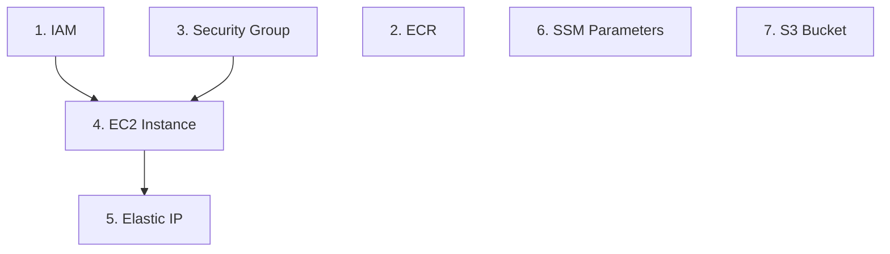

# AWS Resource Creation

Step-by-step tutorial for provisioning every AWS resource this project's
free-tier deployment needs, from an empty AWS account. Each file explains
one resource: what it is, why it's needed, every command broken down flag
by flag, and how to verify it worked before moving on.

This is the first of two phases — see
[AWS tutorials overview](../README.md) for how this fits with the
**integration** phase that follows.

## Shortcut: run it as a script

Everything below is also automated in
[scripts/aws-create-resources.sh](../../../../scripts/aws-create-resources.sh) —
safe to re-run (it checks whether each resource already exists first).
It does **not** set application secrets (it doesn't have your API keys) —
that stays a manual step, same as in the walkthrough below.

```bash
export AWS_REGION=ap-south-1   # required
./scripts/aws-create-resources.sh
```

See the script's header comment for the full list of optional env vars
(`PROJECT_NAME`, `INSTANCE_TYPE`, `VPC_ID`, `SUBNET_ID`, ...). Read the
walkthrough below first if this is your first time setting this up —
the script is a shortcut for someone who already understands each step,
not a replacement for understanding them.

## Order

Follow these in order — later steps depend on earlier ones:

0. **[Prerequisites](00-prerequisites.md)**
   Accounts you need (AWS, GitHub, OpenAI, Tavily, E2B), local tools to
   install, and how to authenticate each CLI. Start here if any of the
   commands in later steps would fail with "command not found" or an auth
   error.

1. **[IAM — Identities and Permissions](01-iam.md)**
   The `gha-deploy` user (for CI/CD) and `ec2-app-role` (for the EC2
   instance itself). Everything else needs one of these to exist first.

2. **[ECR — Container Image Registry](02-ecr.md)**
   Where built Docker images get stored, between CI/CD building them and
   the server pulling them.

3. **[Security Group — Network Firewall](03-security-group.md)**
   Which ports are reachable from the internet (80, 443, 3000 — nothing
   else, no SSH).

4. **[EC2 Instance — The Server](04-ec2-instance.md)**
   The actual virtual machine the application runs on. Needs the IAM
   instance profile and the security group from steps 1 and 3.

5. **[Elastic IP — A Fixed Public Address](05-elastic-ip.md)**
   A permanent public IP for the instance, so it doesn't change every time
   the instance stops/starts.

6. **[SSM Parameter Store — Application Secrets](06-ssm-parameters.md)**
   Where API keys and config values live — never in git, fetched fresh at
   deploy time.

7. **[S3 Bucket — Document Storage](07-s3-bucket.md)**
   Durable storage for the RAG pipeline's source documents.

## Dependency graph



ECR, SSM Parameters, and S3 don't depend on anything else and can be
created in any order — only the EC2 instance and Elastic IP have a strict
dependency chain (instance needs IAM + security group first; the Elastic
IP needs the instance to exist first).

## After this

Once all seven resources exist, nothing is actually running yet — resource
creation just builds the empty scaffolding. The next phase,
**integration**, is where CI/CD, Docker Compose, and the deploy pipeline
connect these pieces together so that a `git push` actually results in a
running, reachable application. See `docs/tutorials/aws/integration/`.
