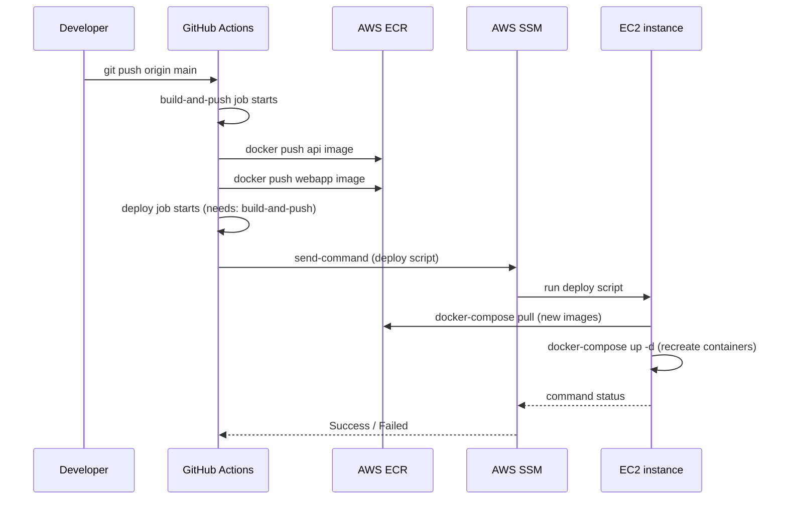

# CI/CD Pipeline Explained

What CI/CD is in general, then a step-by-step walkthrough of this project's
actual pipeline: [.github/workflows/deploy.yml](../../../.github/workflows/deploy.yml).

## Part 1 — What is CI/CD?

**CI/CD** stands for **Continuous Integration** and **Continuous
Delivery/Deployment**. It's the practice of automating the steps between
"I wrote some code" and "that code is running in production," so a human
doesn't have to manually build, test, and deploy every single change.

### Continuous Integration (CI)

Every time someone pushes code, an automated process:
- Builds the project (compiles it, builds a container image, etc.)
- Runs tests
- Flags problems immediately, before they reach anyone else

The word "integration" refers to merging everyone's changes together
frequently and catching conflicts/breakage early, rather than discovering
problems weeks later when a big feature branch finally merges.

### Continuous Delivery / Deployment (CD)

Once code passes CI, it's automatically **packaged and shipped**:
- **Continuous Delivery** — the code is packaged and ready to deploy at the
  push of a button (a human still approves the final release).
- **Continuous Deployment** — there's no button; passing CI *automatically*
  deploys to production.

This project uses continuous deployment: every push to `main` builds new
images and deploys them, no manual approval step.

### Why bother automating this?

- **Consistency** — the exact same build/deploy steps run every time,
  eliminating "works on my machine" or "I forgot a step" mistakes.
- **Speed** — pushing code and having it live minutes later, instead of a
  manual multi-step process someone has to remember and execute correctly.
- **Confidence** — every change goes through the same pipeline, so you know
  what's running in production was actually built the same way as what's
  in git history.
- **Fast feedback** — if a build breaks, you find out in minutes, not the
  next time someone happens to try deploying.

### The general shape

```
Push code  →  Build  →  Test  →  Package (image)  →  Deploy  →  Verify
```

Different tools implement this differently — GitHub Actions, GitLab CI,
Jenkins, CircleCI — but the shape is the same everywhere: a sequence of
automated steps ("jobs") triggered by an event (usually a `git push`).

## Part 2 — This project's actual pipeline

We use **GitHub Actions**, GitHub's built-in CI/CD tool. Workflows are YAML
files in `.github/workflows/`. Ours is called `deploy.yml`, and it has two
jobs: `build-and-push`, then `deploy`.

### The trigger

```yaml
on:
  push:
    branches: [main]
  workflow_dispatch: {}
```

This workflow runs automatically on every push to `main`. `workflow_dispatch`
also allows triggering it manually from the GitHub Actions UI (useful for
retrying a deploy without needing a new commit).

### High-level flow



### Job 1 — `build-and-push`

Builds both application images and pushes them to **ECR** (AWS's Docker
image registry — see [docker-fundamentals.md](../docker/docker-fundamentals.md)
for what images/registries are).

```yaml
- uses: aws-actions/configure-aws-credentials@v4
  with:
    aws-access-key-id: ${{ secrets.AWS_ACCESS_KEY_ID }}
    aws-secret-access-key: ${{ secrets.AWS_SECRET_ACCESS_KEY }}
    aws-region: ${{ secrets.AWS_REGION }}
```

`secrets.*` pulls encrypted values from the repo's GitHub Actions secrets
(Settings → Secrets and variables → Actions) — never hardcoded, never
visible in logs. This step authenticates the runner as our `gha-deploy` AWS
IAM user, so subsequent AWS CLI/SDK calls in this job are authorized.

```yaml
- uses: aws-actions/amazon-ecr-login@v2
  id: ecr
```

Logs Docker into our ECR registry, so `docker push` will be accepted.
`id: ecr` lets later steps reference this step's output, e.g.
`${{ steps.ecr.outputs.registry }}`.

```yaml
- name: Build & push api image
  run: |
    docker build -t ${{ steps.ecr.outputs.registry }}/multi-agentic/api:${{ github.sha }} \
      -t ${{ steps.ecr.outputs.registry }}/multi-agentic/api:latest -f Dockerfile .
    docker push ${{ steps.ecr.outputs.registry }}/multi-agentic/api:${{ github.sha }}
    docker push ${{ steps.ecr.outputs.registry }}/multi-agentic/api:latest
```

Builds the `api` image from the root `Dockerfile`, tags it **two ways**:
- `${{ github.sha }}` — the exact commit hash, e.g. `80e8a66...` — an
  immutable, unique reference to precisely this version of the code.
- `latest` — a moving pointer that always means "the newest build."

Both tags get pushed to ECR. The `webapp` step does the same thing for the
frontend, from `./webapp/Dockerfile`, with one extra piece:

```yaml
docker build \
  --build-arg NEXT_PUBLIC_API_URL=${{ secrets.PUBLIC_API_URL }} \
  ...
```

`NEXT_PUBLIC_API_URL` is baked into the frontend's compiled JavaScript at
**build time** (Next.js requirement for anything the browser needs to read),
so it has to be passed in here rather than as a runtime environment
variable — the running container can't change it after the fact.

### Why tag with the commit SHA at all?

Using the immutable SHA tag (not just `latest`) means the deploy step below
can pin *exactly* which build gets deployed — if `main` gets a new commit
between the build finishing and the deploy step running, we still deploy
the version that was actually just built and tested, not whatever happens
to be `latest` at that instant.

### Job 2 — `deploy`

```yaml
deploy:
  needs: build-and-push
```

`needs:` makes this job wait for `build-and-push` to succeed first — if the
build fails, nothing gets deployed.

The deploy step doesn't SSH into the server. Instead it uses **AWS Systems
Manager (SSM) Run Command**, which lets AWS run a shell script on the EC2
instance remotely, authenticated entirely through IAM — no SSH key to
manage, no open port 22.

Step by step, the script that actually runs *on the EC2 instance*:

```bash
aws ecr get-login-password --region ... | docker login --username AWS --password-stdin ...
```
Logs the EC2 instance's Docker daemon into ECR too — it needs to pull the
images that were just pushed.

```bash
mkdir -p /opt/app && cd /opt/app
```
`/opt/app` is where the app's deploy files live on the instance
(`docker-compose.deploy.yml`, `nginx/nginx.conf` — see
[aws tutorials](../aws/) once written for how those got there).

```bash
aws ssm get-parameters-by-path --path /multi-agentic --with-decryption --output json > /tmp/params.json
python3 -c "... write .env from those parameters, plus ECR_REGISTRY and IMAGE_TAG ..."
```
Pulls secrets (API keys, etc.) from **SSM Parameter Store** — not stored in
git, not stored in the GitHub Actions config, fetched fresh on every deploy
— and writes them into a `.env` file the compose file will read.
`IMAGE_TAG` is set to `${{ github.sha }}`, the exact commit that was just
built — this is how the instance knows which specific image version to pull.

```bash
docker-compose -f docker-compose.deploy.yml pull
docker-compose -f docker-compose.deploy.yml up -d
```
Pulls the new images from ECR and recreates any containers whose image
changed. Containers with no image change (e.g. `redis`, if untouched) are
left running undisturbed.

### The JSON-parameters trick

```python
python3 -c "
import json
with open('/tmp/deploy.sh') as f:
    lines = f.read().splitlines()
with open('/tmp/ssm_params.json', 'w') as f:
    json.dump({'commands': lines}, f)
"
```

SSM's `send-command` needs the script passed as a list of command strings.
The straightforward way — `--parameters commands="..."` as a shell string —
breaks once the script itself contains double quotes (which it does, e.g.
around JMESPath queries). Building the JSON properly with Python's
`json.dump` handles all the escaping correctly, then it's passed via
`--parameters file:///tmp/ssm_params.json` instead of the fragile shorthand
syntax.

### Verifying the deploy actually worked

```bash
STATUS=$(aws ssm get-command-invocation ... --query "Status" --output text)
if [ "$STATUS" != "Success" ]; then
  echo "Deploy command finished with status: $STATUS"
  exit 1
fi
```

This is important: SSM's `send-command` returns immediately once the
command is *dispatched*, not once it's *finished*. Without explicitly
checking the final status and failing the job on anything other than
`Success`, GitHub Actions would report the whole workflow as green even if
the actual deploy script failed on the instance — a silent failure. This
check is what turns "the job pinged the server" into "we know it worked."

## Part 3 — Secrets, and why they're never in the code

Everything sensitive — AWS credentials, the EC2 instance ID, the ECR
registry URL — lives in **GitHub Actions secrets**, injected only at
workflow run time, encrypted at rest, and masked in logs (shown as `***`
even if a step accidentally echoes them). See
[docs/aws-setup-guide.md](../../aws-setup-guide.md) Part 2 for the full list
and how they're set.

Application secrets (OpenAI/Tavily/E2B API keys) live one layer further out
— in **AWS SSM Parameter Store**, not even in GitHub. The deploy script
fetches them fresh on every run. This means rotating a key is just updating
one SSM parameter — no code change, no new commit, no rebuild required.

## Summary

| Stage | Where it happens | What it does |
|---|---|---|
| Trigger | GitHub | Push to `main` starts the workflow |
| Build | GitHub Actions runner | Builds `api` and `webapp` Docker images |
| Push | GitHub Actions runner → ECR | Uploads both images, tagged by commit SHA and `latest` |
| Deploy trigger | GitHub Actions runner → AWS SSM | Sends a shell script to run on the EC2 instance |
| Deploy execution | EC2 instance | Pulls new images from ECR, refreshes `.env` from SSM, recreates containers |
| Verification | GitHub Actions runner | Checks the SSM command's actual final status, fails the job if it didn't succeed |

## What's next

The pipeline above deploys *to* AWS infrastructure that has to exist first
— EC2 instance, ECR repos, IAM roles, SSM parameters, security groups. How
to set all of that up from scratch is covered in the AWS tutorials once
written.
